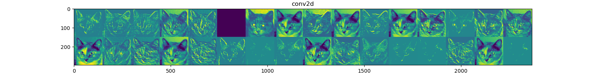

### The first layer's output (conv2d)

### The second layer's output (maxpooling2d)

### The third layer's output (conv2d)

### The forth layer's output (maxpooling2d)

### The fifth layer's output (conv2d)

### The sixth layer's output (maxpooling2d)

### The seventh layer's output (conv2d)

### The eighth layer's output (maxpooling2d)

